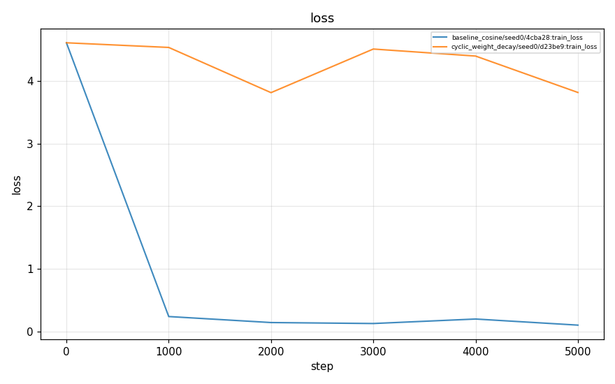
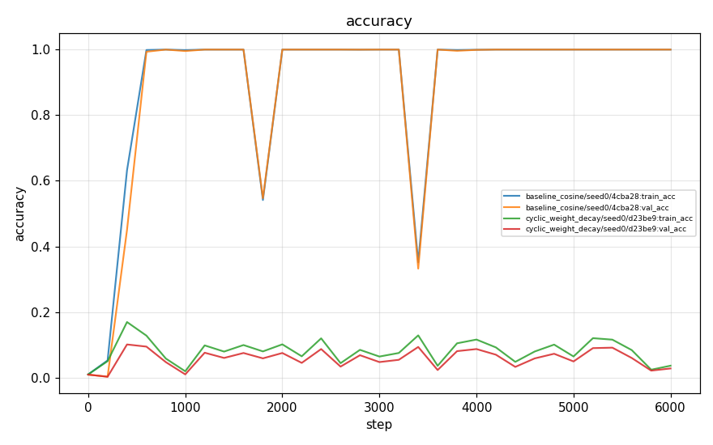
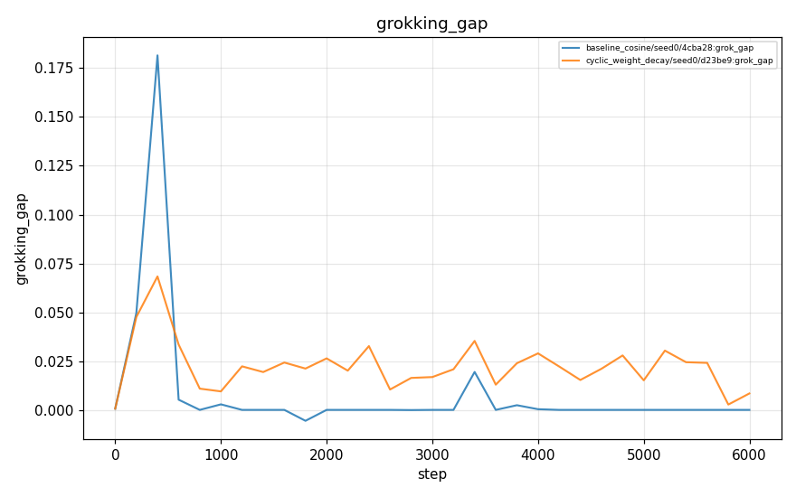
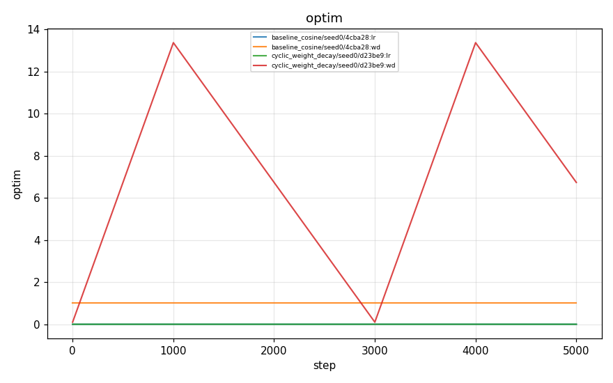

# Experiment report: arithmetic_modular_grok

- runs ingested: **2**
- git SHAs present: 2ab4bb8f11
- ⚠️ some runs were produced from a **dirty** git tree (not reproducible)

> This report summarizes *measured tooling output*. It makes no claim about whether any hypothesis was confirmed — see `planning/hypotheses/` for the claims and their pre-registered stop conditions.

## Run summary

| run_id                                     | schedule            |   seed | git_sha    | status    |   final_train_acc |   final_val_acc |   final_grok_gap |   grok_step |   grokked |
|:-------------------------------------------|:--------------------|-------:|:-----------|:----------|------------------:|----------------:|-----------------:|------------:|----------:|
| baseline_cosine-20260609T003730-4cba28     | baseline_cosine     |      0 | 2ab4bb8f11 | completed |            1      |         1       |         0        |         600 |         1 |
| cyclic_weight_decay-20260609T003847-d23be9 | cyclic_weight_decay |      0 | 2ab4bb8f11 | completed |            0.0364 |         0.02799 |         0.008408 |          -1 |         0 |

## Plots

### loss

### accuracy

### grokking_gap

### optim

## Modular-grokking summary (H001 cheap testbed)

| schedule | seed | final_train | final_val | grok_step | grokked |
|---|---|---|---|---|---|
| baseline_cosine | 0 | 1.000 | 1.000 | 600 | yes |
| cyclic_weight_decay | 0 | 0.036 | 0.028 | — | no |

- best baseline val_acc **1.000** vs best non-baseline **0.028** (Δ -0.972).
- earliest grok step — baseline: 600.0, non-baseline: — (lower = grokked sooner).

> Note: weight-decay schedule multipliers (e.g. `cyclic_weight_decay`'s `wd_max_mult`) are **relative to `train.weight_decay`**. The modular default uses heavy `base_wd`, so a 20× peak over-regularizes — co-tune them. This is a knob to sweep, not a fixed result.
