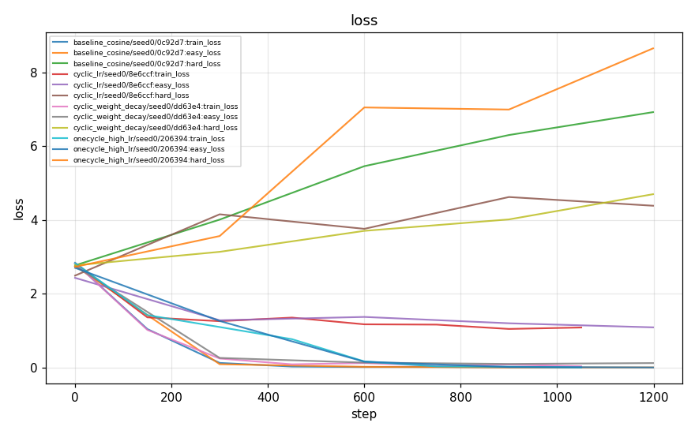
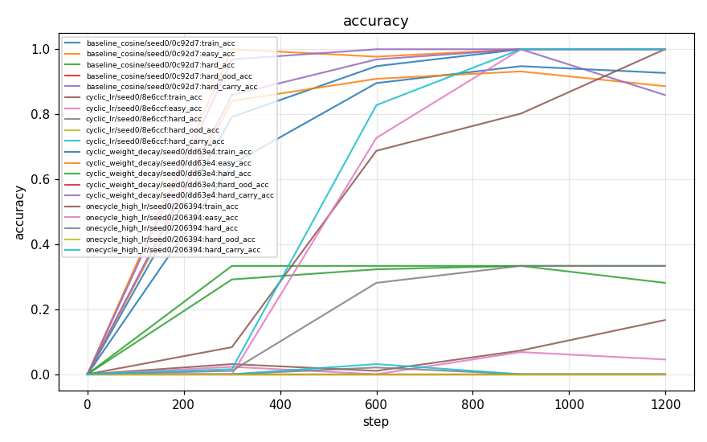
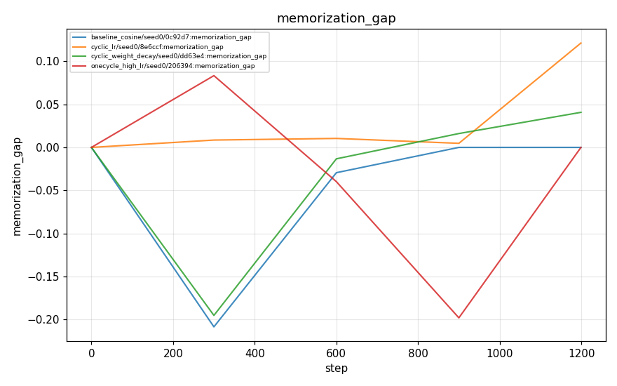
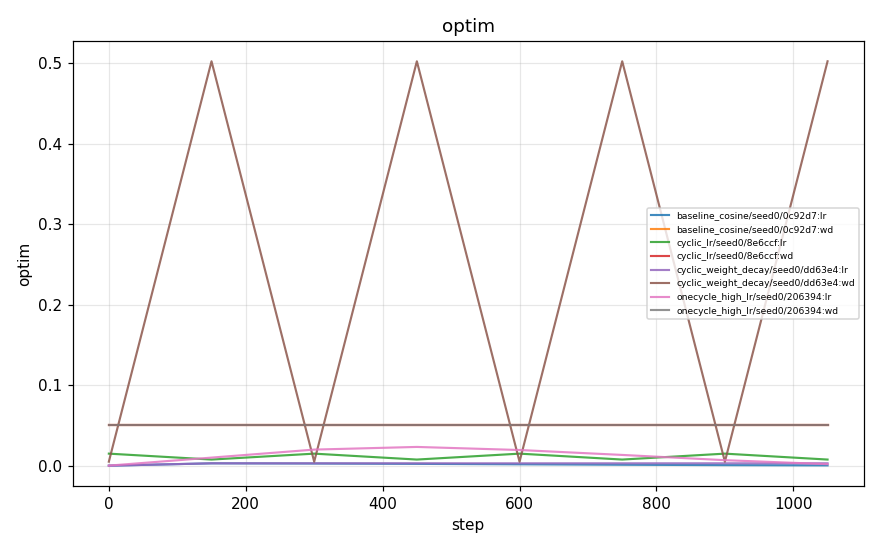
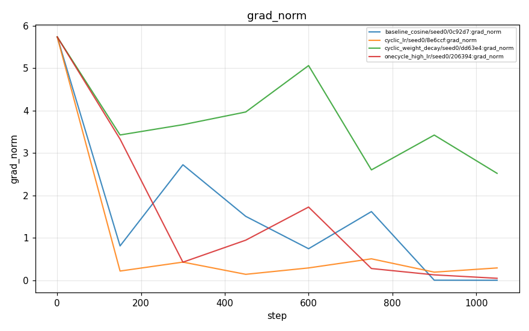

# Experiment report: arithmetic_catapult

- runs ingested: **4**
- git SHAs present: 7d16a3a530
- ⚠️ some runs were produced from a **dirty** git tree (not reproducible)

> This report summarizes *measured tooling output*. It makes no claim about whether any hypothesis was confirmed — see `planning/hypotheses/` for the claims and their pre-registered stop conditions.

## Run summary

| run_id                                     | schedule            |   seed | git_sha    | status    |   final_train_loss |   final_easy_acc |   final_hard_acc |   final_train_acc |   final_memorization_gap |   num_params |   final_hard_ood_acc |   final_hard_carry_acc |
|:-------------------------------------------|:--------------------|-------:|:-----------|:----------|-------------------:|-----------------:|-----------------:|------------------:|-------------------------:|-------------:|---------------------:|-----------------------:|
| baseline_cosine-20260608T231316-0c92d7     | baseline_cosine     |      0 | 7d16a3a530 | completed |          0.0001124 |          1       |           0.3333 |            1      |                  0       |       152300 |                    0 |                 1      |
| cyclic_lr-20260608T231421-8e6ccf           | cyclic_lr           |      0 | 7d16a3a530 | completed |          1.016     |          0.04545 |           0      |            0.1667 |                  0.1212  |       152300 |                    0 |                 0      |
| cyclic_weight_decay-20260608T231450-dd63e4 | cyclic_weight_decay |      0 | 7d16a3a530 | completed |          0.0736    |          0.8864  |           0.2812 |            0.9271 |                  0.04072 |       152300 |                    0 |                 0.8594 |
| onecycle_high_lr-20260608T231349-206394    | onecycle_high_lr    |      0 | 7d16a3a530 | completed |          0.0003328 |          1       |           0.3333 |            1      |                  0       |       152300 |                    0 |                 1      |

## Plots

### loss

### accuracy

### memorization_gap

### optim

### grad_norm

## Catapult crossover check (hard split)

- best baseline hard-accuracy: **0.333** (baseline_cosine/seed0)
- best non-baseline hard-accuracy: **0.333** (onecycle_high_lr/seed0)
- Δ(best non-baseline − best baseline) = **+0.000** → the baseline is **not yet** beaten on the hard split.

> Interpretation guard: this is a small-scale, single-report snapshot. A real crossover claim (per H001) requires matched compute, multiple seeds, and the pre-registered stop conditions in `planning/hypotheses/H001-catapult-arithmetic.md`.
